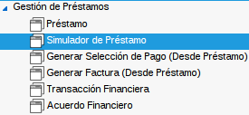
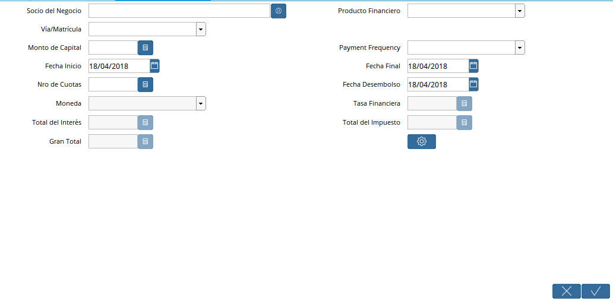
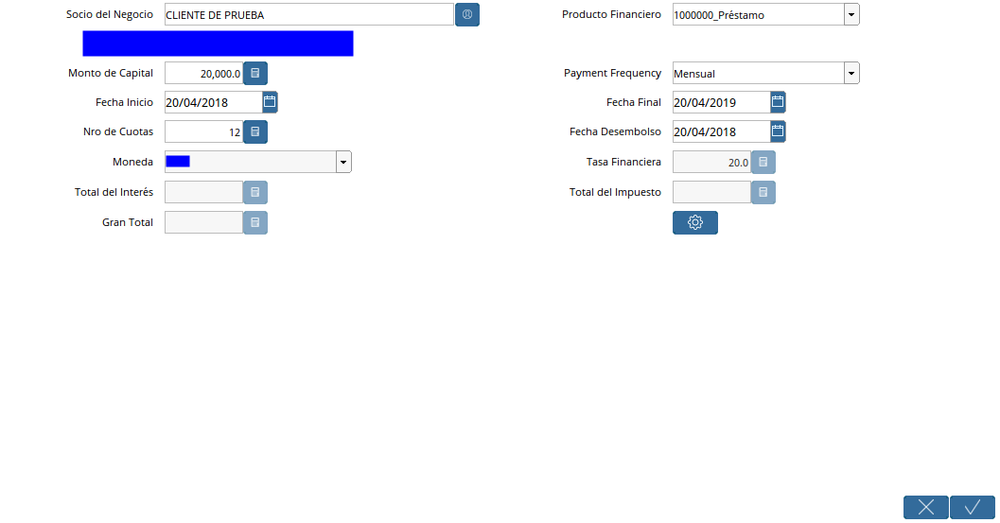
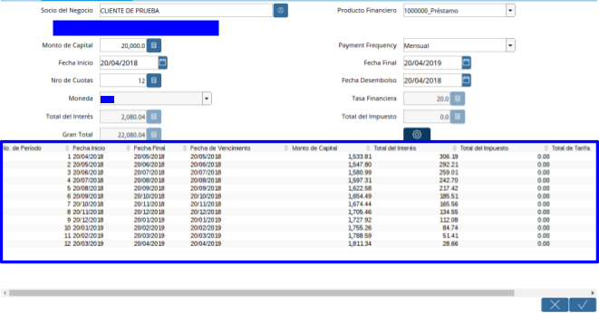
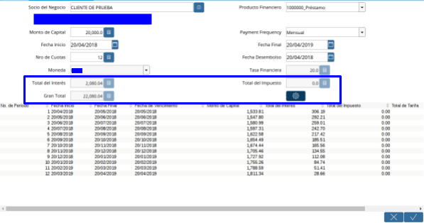
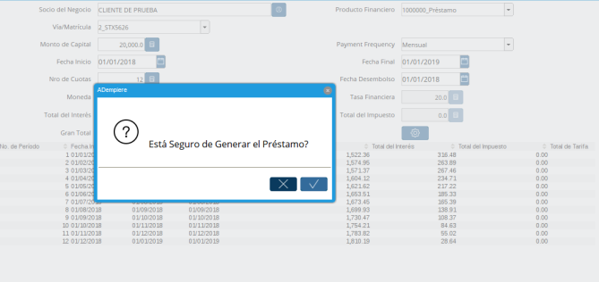
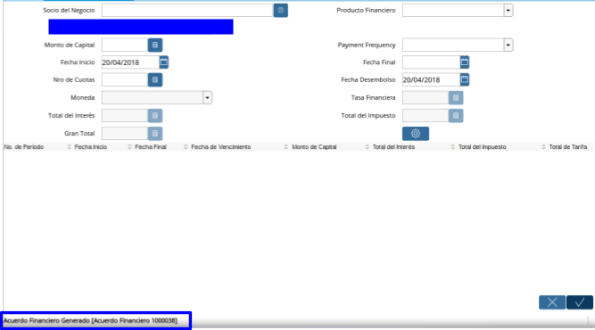

# Ejecución

### Simulación

La simulación de préstamos es ideal para realizar cálculos rápidos y consultas de préstamos a solicitantes, generando una tabla simulada de amortización completa, además de monto total estimado de impuesto a pagar, monto total estimado de interés a pagar y cuota fija estimada.

Se creó un formulario o ventana personalizada convirtiendo a ADempiere en una herramienta eficiente y sumamente útil en cuanto a tomas de decisiones se trata tanto para la entidad (Prestamista) como para el solicitante sin ser necesario generar datos y guardar en nuestra base de datos, asimismo, reduce los tiempos de gestión del usuario con ADempiere.

A continuación se detalla las instrucciones para proceder a simular un préstamo de forma exitosa:

Vaya a la ventana de Simulador de Préstamo (Adjunto Imagen)

A continuación se desplegará la siguiente ventana disponible para simular un préstamo.

Proceda a llenar los parámetros necesarios para la simulación de préstamo:

**Socio del Negocio:** Indique el socio del negocio solicitante previamente configurado (Vea *Configuraciones Esenciales para el Proceso de Préstamo*).

**Producto Financiero:** Seleccione el producto financiero o préstamo a aplicar previamente configurado (*Vea Configuración de Producto Financiero (Préstamo)*),este parámetro posee una validación, los préstamos disponibles en esta lista dependerá de el grupo de socio de negocio al cual pertenezca el socio de negocio seleccionado y la configuración del producto financiero en aplicación de producto.

**Monto de Capital:** Indique el monto del préstamo solicitado.

**Frecuencia de Pago:** ADempiere establece por herencia la frecuencia configurada en el producto financiero seleccionado, sin embargo puede modificarlo.

**Fecha Inicio:** Indique la fecha de inicio del préstamo.

**Fecha Final:** ADempiere calcula y establece la fecha basada en la frecuencia y la fecha de inicio, sin embargo puede modificarlo.

**Nro de Cuotas:** ADempiere establece por herencia el Nro de cuotas basadas en la cantidad mínima de cuotas configurada en el producto financiero seleccionado, sin embargo puede modificarlo.

**Moneda:** ADempiere establece por herencia la moneda basada en la configuración del producto financiero seleccionado, sin embargo puede modificarlo.

**Tasa Financiera:** ADempiere establece por herencia la tasa financiera basada en la configuración del producto financiero seleccionado, no puede ser modificado.

Seleccione la opción procesar 

A continuación verá los siguientes resultados:

### Interpretando la Ventana

Panel de resultados de **_Amortización Estimada:_**

La amortización estimada es generada basada en el sistema francés, el mismo consiste  en mantener cuotas de amortización constantes, debido a esto, cada mes la entidad recibe intereses en función del capital pendiente, es decir, en los primeros períodos, la entidad percibe una cantidad mayor de intereses que de capital y en los períodos finales más capital e intereses menores, la frecuencia de las cuotas estimadas (Resultado) varía según la frecuencia de pago seleccionada como parámetro ó heredado desde el producto financiero, el número de cuotas dependerá del Nro de Cuota indicado en el simulador  ó heredado desde el producto financiero.

Panel de resultados **_Totales Estimados_**:

Los totales estimados le indicarán al solicitante el Total de Interés, Total de Impuesto, y el Total General en la cual es sumado el Capital más el Total de Interés más Total de Impuesto, arrojando entonces el monto que definitivamente se estima cancelará el solicitante si es procesado el préstamo.

### Generar Préstamo desde Simulación

Una vez procesada la simulación:

Seleccione la opción ok 

A continuación se desplegará el siguiente dialogo

 Si desea generar el préstamo seleccione la opción ok , caso contrario seleccione la opción cancelar 

Si seleccionó la opción OK el sistema generará el préstamo de forma exitosa generando el siguiente mensaje indicando el número del préstamo generado:

