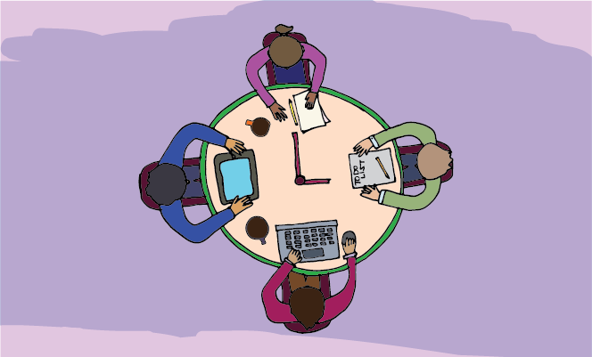
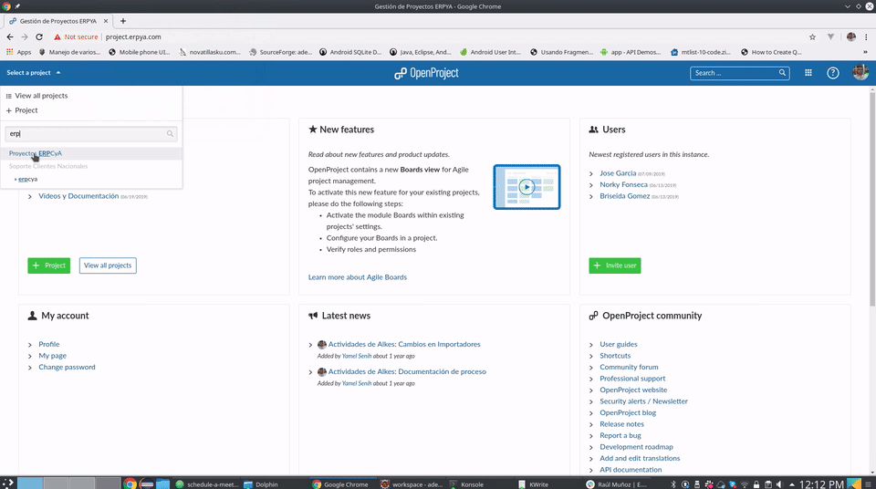

# **Acordar una Reunión**

## **Justificación**
Constantemente el cliente demanda requerimientos nuevos o soporte que viene acompañados de muchas inquietudes de parte de la persona de sistemas que atiende la solicitud. En algunos casos es de vital importancia tener una pequeña reunión para aclarar dudas y poder estimar el alcance de ciertos requerimientos. 

## **¿Cuando se debe agendar una reunión?**
Las reuniones deben tomarse como una herramienta para aclarar cualquier duda relacionada con el requerimiento del cliente. **En ese sentido sólo se debe agendar una reunión si ya existe un requerimiento formal escrito**.

## **Cual es el medio para agendar una reunión?**
[E.R.P. Consultores y Asociados, C.A.](http://erpya.com/) tiene distintos medios de comunicación entre los cuales se encuentran:
- [Slack](https://erpya.slack.com): Es un chat dinámico que permite la integración con distintas herramientas corporativas (sin guardar historia de conversación pasada una semana).
- [Open Project](http://project.erpya.com/): Utilizado con el fin de llevsr el control de cada una de las solicitudes de los clientes así como sus vencimientos y estados.
- [OSTicket](http://helpdesk.erpya.com/): Usado como plataforma de tickets con la cual el cliente puede ver el historial de sus solicitudes y su solución.
- Correo: Utilizado muchas veces cuando el cliente no tiene acceso a Slack o a la plataforma de Tickets.

A pesar de las múltiples herramientas que posee [E.R.P. Consultores y Asociados, C.A.](http://erpya.com/) siempre se debe utilizar el [Open Project](http://project.erpya.com/) para agendar una reunión, si desconoce la forma para crear una reunión puede ver el siguiente gif

Si desea enviar una notificación por correo desde la agenda lo puede hacer presionando el botón *Enviar para Revisión* 

## **¿De qué manera se debe agendar una reunión?**
Normalmente las conversaciones entre [E.R.P. Consultores y Asociados, C.A.](http://erpya.com/) y los clientes es a través de [Slack](https://erpya.slack.com) o por teléfono. De cualquier manera para que pueda existir una reunión se debe seguir el siguiente procedimiento:

- Convocar la reunión a través de [Slack](https://erpya.slack.com), Correo o por teléfono.
- El cliente y el personal de sistemas deben acordar la cita de manera que puedan cumplir en la medida de lo posible.
- Confirmar la reunión: Antes de cualquier otro paso se debe confirmar la asistencia a la reunión, **si no existe confirmación entonces no existirá reunión**.
- Crear la reunión en [Open Project](http://project.erpya.com/): **Es muy importante que se defina bien la hora, los participantes y la agenda para el día de la reunión**
- Después de crear la reunión se debe compartir el URL generado de la misma (el URL del ejemplo es este: http://project.erpya.com/meetings/22)
- Ya con el URL compartido ambos deben confirmar la asistencia a la misma.

## **¿Qué se debe tomar en cuenta antes de la reunión?**
1. Una agenda clara de los puntos a tratar: Es muy importante tener claro cual es la agenda de la reunión, esto ayudará a los participantes a prepararse para no tomar tiempo de la reunión en repaso de tareas olvidadas
2. El objetivo final de la reunión: Es muy bueno que cada uno de los participantes pueda conocer lo que se logrará al finalizar la reunión (Toma de decisión entre otros).
3. El tiempo máximo de la reunión: Permitirá planificar el trabajo de cada uno de los participantes, hay personas que tienen actividades con un horario estricto y no se pueden solapar con una reunión con exceso de tiempo. 

## **¿Cuanto es el tiempo máximo para una reunión?**
Las reglas de Percolate para las reuniones:
1. ¿Realmente hace falta una reunión?
2. Por norma, las reuniones deben durar 15 minutos.
3. Sin espectadores.
4. Di de entrada tu objetivo.
5. Decide tareas y asígnalas.
6. No traigas ordenadores ni teléfonos).

Para el caso de [E.R.P. Consultores y Asociados, C.A.](http://erpya.com/) es conveniente que las reuniones no excedan los **45 minutos**, las reuniones extensas solo crean cansancio y en lugar de ayudar a avanzar solo generan un ambiente que no ayuda a la toma de decisiones.

**Como escriben los autores de Reinicia, cada minuto que evitas pasar en una reunión es un minuto en el que puedes hacer trabajo de verdad. O, mejor, en irte a casa a tu hora.**

http://erpya.com/
