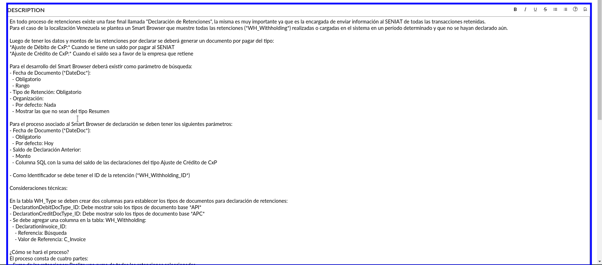
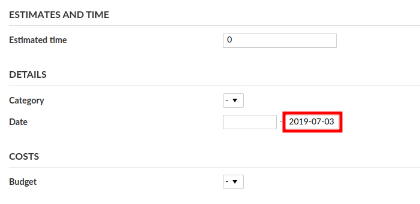
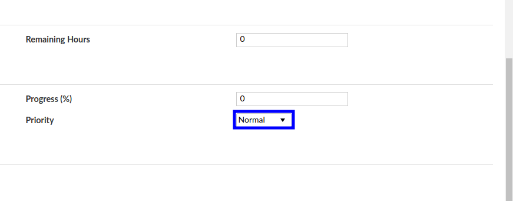

# **Documentar una Tarea / Error**

## **Justificación**
Actualmente no existe un patrón o estándar para reportar un tipo de issue en Open Project provocando un problema al momento de identificar problemas, recuperar información acerca del seguimiento, trasladar responsabilidades a personas del equipo que no se encuentran familiarizadas con el caso o issue en cuestión y falta de información en algunos casos. En tal sentido el presente documento pretende establecer un estándar para la elaboración o reporte de issue en Open Project u otra aplicación de control y seguimiento de un proyecto o tarea.

## **Pasos a Seguir para un reporte correcto**
Para reportar un error es muy importante tener a la mano información acerca del comportamiento.

En la página: [https://www.mediawiki.org/wiki/How_to_report_a_bug](https://www.mediawiki.org/wiki/How_to_report_a_bug) se encuentra información de ejemplo para reportar un bug. Para resumir es recomendable tomar en cuenta lo siguiente:

### **Recomendaciones Rapidas**
 - Sea preciso.
 - Sea claro: explique cómo reproducir el problema, paso a paso para que otros usuarios puedan reproducir el error o entender la solicitud.
 - Incluya solo un problema por tarea.
 - Incluya cualquier enlace y ejemplo relevante.

### **Antes de hacer el issue...**

#### **¿Puedes reproducir el error?**
Intenta reproducir tu problema usando una versión reciente del software, para ver si lo que está sucediendo ya fue solventado. Si el error es en producción, intente reproducir el mismo en un ambiente de pruebas.

#### **¿Alguien reportó anteriormente el error?**
Use el buscador del [OSTicket](http://helpdesk.erpya.com/) / [Open Project](http://project.erpya.com/) para ver si el error ya fue reportado por alguien más o la nueva funcionalidad ya fue solicitada.

Si no está seguro de que exista el reporte de error entonces igual puede reportarlo, es mejor tener un ticket duplicado que un error sin reportar.

#### **¿Ya intentó resolver el error?**
Algunos problemas son consecuencias de intentar resolver el error sin tener conocimiento del procedimiento correcto.

## **Reportando un nuevo error o solicitud de mejora**
Si tiene un error para reportar y no lo ha hecho préviamente, puede hacerlo en los siguientes links:

* [OSTicket](http://helpdesk.erpya.com/)
* [Open Project](http://project.erpya.com)

### **Cargando información del error**
#### **Título**
Corresponde al resumen del problema (No es una sugerencia de solución).
* Ejemplo de un buen título: "Al seleccionar un género no funciona".
* Ejemplo de un mal título: "El programa no funciona".

#### **Asignado a**
Ignore este campo: la asignación del mismo lo debe realizar un administrador de proyecto o encargado con experiencia.

#### **Description**
Detalle completo del error, debe tener el mayor detalle posible.
La descripción puede contener lo siguiente:

##### **Para errores**

* Pasos para reproducir: Mínimo, pasos faciles de seguir que pudieran describir como replicar el problema. Incluya cualquier configuración necesaria.

    * Ejemplo:
        1. Vaya a [http://demo.erpya.com:8888](http://demo.erpya.com:8888) con Google Chrome como navegador en su versión **71.0.3578.98 (Official Build) (64-bit)**
        2. Asegúrese de haber ingresado.
        3. Seleccione el menú: "Mis preferencias";
        4. Vaya a: "Género" y seleccione "Masculino" desde la lista desplegable; Haga click en el botón "Guardar".

* Resultado Actual: Resultado de la aplicación al momento de seguir los pasos prévios.
    * Ejemplo: "El género Masculino no se muestra en mi perfil"
* Resultado Esperado: "Mi género es mostrado en mi perfil"

##### **Para una propuesta de mejora**
Una descripción de qué es lo que desea lograr y por qué. Una historia de usuario es una buena vía para realizar esto. Para consultar mas documentación puede ir a http://interactions.acm.org/archive/view/november-december-2013/user-stories-dont-help-users-Introducing-persona-stories.

* Ejemplo: "Como nuevo editor, me gustaría ser reconocido por mi contribución al proyecto, por lo que me siento bienvenido y valorado"
* Por favor provea cualquier otra información que pueda ser útil, como:
    * Navegadores, temas o sistemas donde haya visto el bug;
    * Vincular a una o más páginas donde se hable acerca del error;
    * Si el problema aparece cada vez, solo ocasionalmente, solo en ciertas páginas, o solo en circunstancias específicas.
* Adjunte un archivo tipo log o una captura de pantalla (pero asegúrese de no mmostrar información confidencial).
* Seleccione uno o varios tags para ubicar o relacionar de manera sencilla el error:

Verifique si su reporte está completo y presione el botón "Crear Tarea". A continuación su reporte de error se publicará y alguien podrá atenderlo.

La prioridad de atención de las tareas o errores reportados pudiera ser determinada por el plan de trabajo de los desarrolladores o funcionales.

## **Campos Obligatorios**
Al momento de crear una tarea o error se debe tomar en cuenta que es obligatorio llenar los siguientes campos:

- **Asunto:** Marcado en color rojo como lo muestra la siguiente imagen debe tener un texto que indique el problema o el cambio a desarrollar de manera resumida

- **Descripción:** Marcado en color azul como lo muestra la siguiente imagen debe tener una descripción detallada de la funcionalidad o los pasos para emular el error, **¡Está prohibído dejar este campo vacío o con un comentario poco detallado!** Tome en cuenta la imagen como punto de partida.

- **Asignado:** Marcado con color azul en la siguiente imagen debe contener la persona a quien se le asignará la tarea o error. De igual manera se debe llenar el responsable si existe.

- **Fecha de Vencimiento:** Marcado con color rojo indica la fecha de entrega de la actividad, tome en cuenta que si no conoce la prioridad del requerimiento deberá consultarlo con su supervisor.

- **Prioridad:** Marcado con color azul indica la prioridad del caso, recuerde no exagerar con esto, no todos los casos son urgentes.

**_Recuerde que su trabajo comienza por documentar cualquier problema o mejora, no debe esperar a que se lo digan. Es su obligación documentar cada una de las tareas_**

## **Resumen**

**Tome en cuenta que como mínimo debe existir un video en formato gif explicando o mostrado como reproducir el error, mientras mas información coloque será mas sencillo reproducir y solucionar el comportamiento.**

Si desea ver cómo generar un archivo gif vaya a [Crear un Video y Comprimirlo como gif: ](../../general/compress-mp4.md)

A continuación se encuentra un ejemplo proveniente de [Open Project](http://project.erpya.com/projects/soporte-sos/work_packages/2905/activity)

