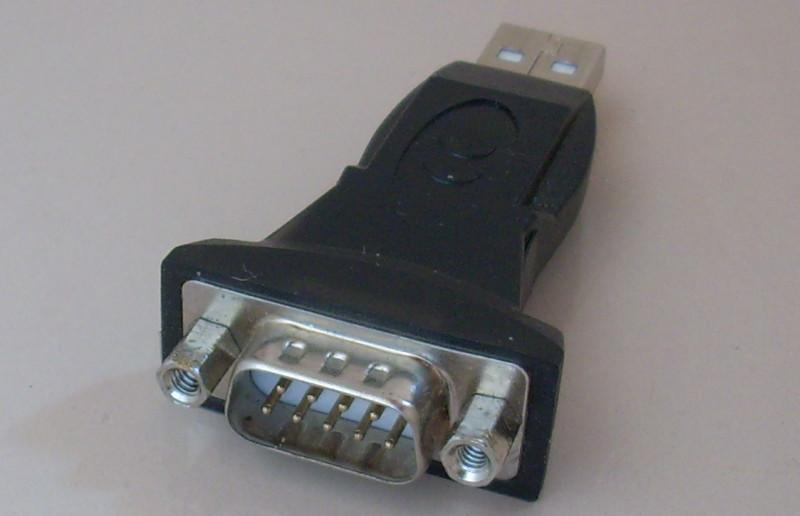
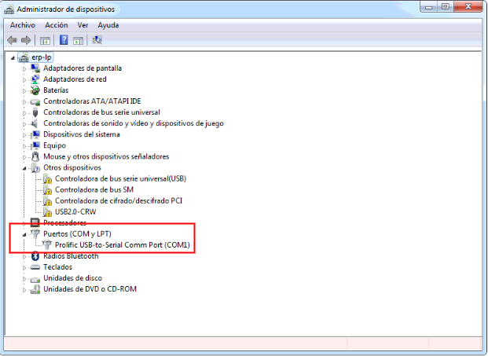
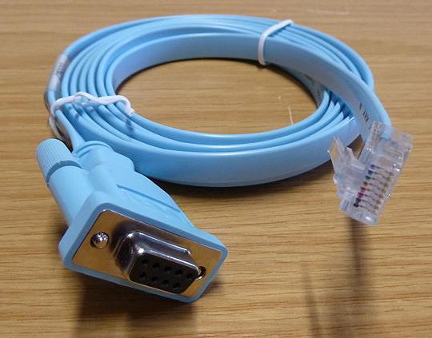
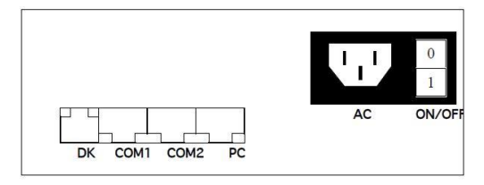

# **Errores comunes Impresora Fiscal**

A continuación se presentan las fallas o incidentes comunes, que debe considerar durante la configuración de la Impresora fiscal VMAX 220, cubriendo así los incidentes que afecten el funcionamiento de esta.

### **No se imprimen los archivos en la Impresora**

Puede Ocurrir por varias razones, las principales son conexión por Hardware a la impresora Fiscal y la configuración de la aplicación Spooler. 

Para Hacer un diagnostico de lo que ocurre lo principal es iniciar desde la conexión por Hardware, esta tiene 3 puntos a tener en cuenta:

 1. Adaptador USB-SERIAL: 

	

	Verificar Drivers del dispositivo al conectar el Adaptador, esto se hace desde el administrador de dispositivos, allí verificar que se conecto un nuevo puerto COM ejemplo: **"COM1"**. 

	

	Si se conecto y no se puede identificar un dispositivo, es decir, ningún dispositivo posee **"COM"** en su nombre, debe instalarse nuevamente los controladores para la correcta comunicación con el Hardware.

 1. Conexión de Cable Serie:

	

	En esté caso observar si la conexión entre el adaptador y el cable, a través del conector DB9 este hecha de manera correcta.

 1. Posición en la que esta el conector RJ45:

	

Comprobar que el conector RJ45 este en el puerto de la impresora marcado con las Siglas **"PC"** en la parte posterior de la impresora.

Si lo anterior esta Correcto Proceder a verificar la aplicación Spooler, en esté caso se debe revisar lo siguiente:

 1. Comprobar Instalación de Spooler
	
	Ingresar al Panel de Control e ingresar a Programas y Características, comprobar si en la lista existe el nombre **"Spooler de impresión VMAX"**, si existe esto quiere decir que la aplicación esta instalada, caso contrario es necesario instalar el Spooler tal como se indica en el manual del fabricante.

 1. Comprobar Directorio de instalación

	Para ello basta con ingresar al disco duro donde se encuentre instalado Windows, entrar en la carpeta **"Archivos de Programas"**, debe existir un directorio con el Nombre **"SpoolerVmax"**.

	Comúnmente se mueve el directorio de instalación de la aplicación. Esto se hace para evitar la necesidad de ejecutar con privilegios de administrador, para casos en los que no se tiene la seguridad conocer la ruta de instalación, se puede buscar con el buscador de archivos de Windows colocando el nombre **"epsSpoolerVmax.exe"**

1. Verificar archivo **"config.dat"** dentro del Directorio de instalación

	Este archivo contiene los datos necesarios para que la impresora interactue con la PC, Tales como puerto de conexión (COMX) y el documento a través del cual recibe los comandos (Document.txt). 

### **Fecha y Hora incorrectas en documentos impresos.**

Cuando sucede que la fecha y hora no esta sincronizada con la fecha actual, dentro de ADempiere existe un Proceso que permite Actualizar esta información.

### **Mensaje error “Dispositivo no Conectado”**

En primera Instancia verificar que la conexión y configuración de la impresora esta debidamente hecha, si luego de esto sigue ocurriendo el problema estaría de parte de la configuración hecha en ADempiere, lo mas recomendable revisar toda la configuración de dispositivo.

### **La pantalla de del impresora muestra el mensaje "Comando no ejecutado"**

Suele suceder cuando se le envía un comando invalido a la impresora, no se permite completar la acción dentro de esta directamente. Cuando la impresora se encuentra en esa condición no permite continuar imprimiendo ningún tipo de archivo. 

La opción mas recomendable, para volver a colocar la impresora operativa es generar un **"Reporte X"** manualmente, esto se hace manteniendo presionados los botones **"X"** y **"OK"** del panel frontal, hasta que inicie la impresión. 

!!! warning "Si Persiste el Problema"

	Si el problema persiste o no se genera el reporte, apagar el equipo durante 30 segundos y luego volver a encenderlo, la impresora debe iniciar normalmente y estar operativa, esto debe hacerse como una ultima opción.

### **Errores de Impresión o procesando el Documento**

Cuando esto ocurre normalmente viene acompañado del mensaje "Comando no ejecutado", es prudente verificar el estado del documento en ADempiere y verificar que el documento no tenga estado "No Valido", o este marcado como Impreso. Pasado el transcurso de unos minutos avanzara el carrete de papel de la impresora mostrando el mensaje **"ANULADO"**.

Confirmada alguna de las situaciones previamente descrita, puede identificarse como alguno de los problemas descritos a continuación:

 | Caso | Documento en Físico(Impresión) | Documento en ADempiere | Acción a Ejecutar |
|:----------:|:----------:|:----------:|:----------:|
|  Ideal  |  Impreso Correctamente  |  Completado Correctamente  |  Nada (Situación Ideal)  |
|  1  |  Impreso Correctamente  |  Factura no Completa   |  [Completar sin Imprimir](http://docs.erpya.com/lve/fiscal-printer/commons-errors-fiscal-printer/#primer-caso-impreso-correctamente-a-traves-de-la-impresora-y-factura-no-completada-en-admempiere)  |
|  2  |  Factura Anulada  |  Completado Correctamente  |  [Anular el Documento](http://docs.erpya.com/lve/fiscal-printer/commons-errors-fiscal-printer/#segundo-caso-la-factura-impresa-esta-anulada-pero-se-encuentra-completada-correctamente-en-adempiere)  |
|  3  |  Sin Impresión  |  Completado Correctamente  |  [Reimprimir](http://docs.erpya.com/lve/fiscal-printer/commons-errors-fiscal-printer/#tercer-caso-completado-correctamente-en-adempiere-pero-no-se-realiza-la-impresion)  |
|  4  |  Documento impreso Incompleto  |  Documento Incompleto o Invalido  |  [Completar sin Imprimir y Luego Anular](http://docs.erpya.com/lve/fiscal-printer/commons-errors-fiscal-printer/#cuarto-caso-el-documento-impreso-quedo-incompleto-y-en-adempiere-el-documento-tiene-un-es-incompleto-o-no-valido)  |

A Continuación se detalla de una manera más Gráfica como proceder con los caso de error de los cuales se tiene registro.

### Primer caso Impreso Correctamente a través de la impresora y Factura no Completada en ADempiere.

Existe un proceso **"Autorizar Documento Fiscal"** para reactivar el completar el documento ADempiere, este se usa de la siguiente manera:

El primer campo de la ventana desplegada sirve para seleccionar el Documento a reimprimir, mientras que el segundo permite elegir la acción sobre el documento.

| Tipo de Autorización |
|----------|
|  Anulación  |
|  Completar (Sin Impresión)  |
|  Reimpresión  |

Para el caso actual debe usarse la opción **"Completar el Documento(Sin Impresión)."** Esta opción permite completar el documento existente en ADempiere y de esta manera generar el documento, que respalde el que se encuentra impreso.

### Segundo caso  la Factura impresa esta Anulada pero se encuentra Completada Correctamente en ADempiere.

Se requiere el Aplicar el Proceso **"Autorizar Documento Fiscal"** a la factura no generada, seleccionando la opción Anular.

En campo de la ventana seleccionar el Documento a anular, en el segundo permite elegir la acción anular sobre el documento. 

| Tipo de Autorización |
|----------|
|  Anulación  |
|  Completar (Sin Impresión)  |
|  Reimpresión  |

Esto se debe hacer para evitar que el documento impreso anulado tenga una referencia generada en ADempiere con un estado exitoso.

### Tercer Caso Completado Correctamente en ADempiere pero no se realiza la impresión

Cuando esto sucede se debe aplicar el mismo proceso de **"Autorizar Documento Fiscal"** , utilizando la opción **"Reimprimir"**.

En campo de la ventana seleccionar el Documento a reimprimir, en el segundo permite elegir la acción Reimpresión sobre el documento. 

| Tipo de Autorización |
|----------|
|  Anulación  |
|  Completar (Sin Impresión)  |
|  Reimpresión  |

Luego acceder a la ventana donde esta la factura en cuestión, e imprimir manualmente usando el botón **"Imprimir Factura en Impresora Fiscal."**

### Cuarto Caso El Documento impreso quedo incompleto y en ADempiere el Documento tiene un es Incompleto o  No-valido

El documento en ADempiere es necesario Anularlo. La forma de solventar esta falla es proceder en dos etapas en la primera se aplica el proceso con la factura afectada seleccionando el parámetro **"Completar (Sin Impresión)"**.

En la segunda etapa se procede aplicar el proceso tomando en cuenta el numero de factura generado por la primera etapa, se le se aplica el proceso seleccionando el parámetro **"Anulación"**.

