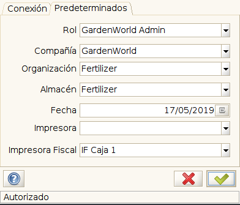
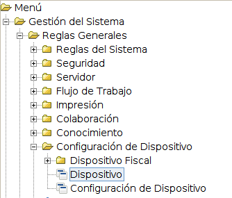
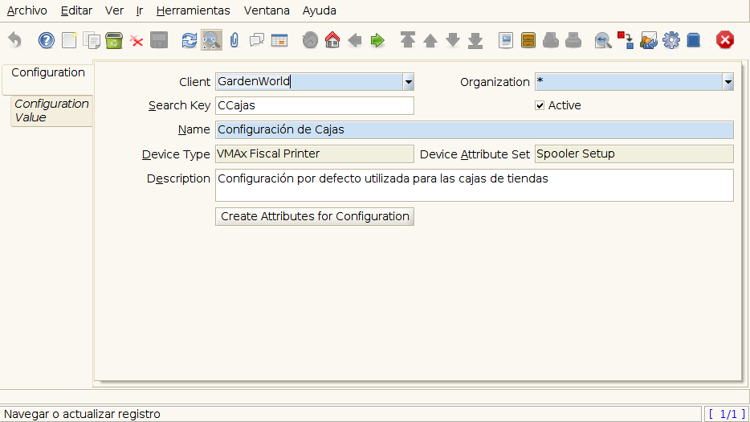
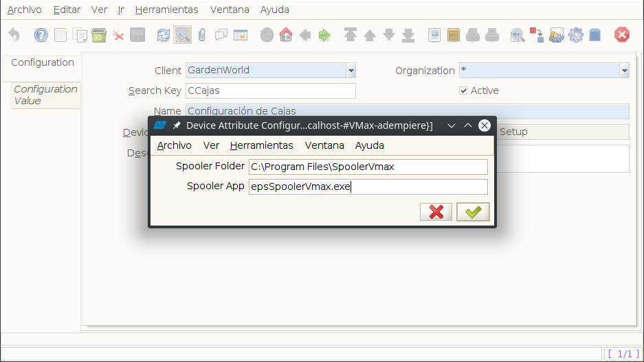
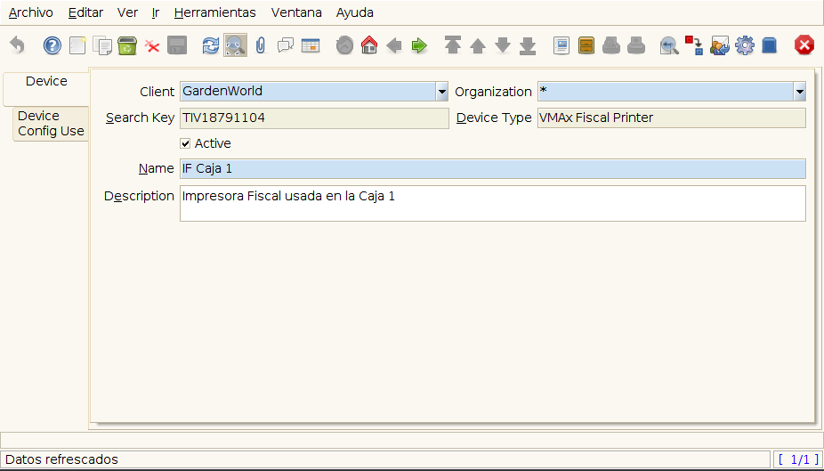
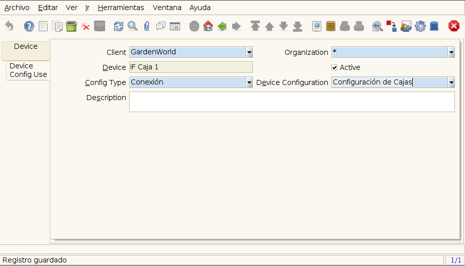

# **Configuración de Impresora Fiscal VMax 220 para Usar con ADempiere**

Requisitos previos:

- Tener un equipo con Windows instalado, bajo la Arquitectura procesador de 32 bits.
- Adaptador USB-Serial Compatible con Windows en la versión del sistema operativo usado (Conector DB9 a USB).
- Instalar la Aplicación Spooler.

Es necesario ingresar a ADempiere desde la  versión de escritorio,  para un correcto funcionamiento es necesario modificar el archivo "RUN_Adempiere.bat" actualizando los parámetros: 

!!! example "Configuración del Classpath"

        ADEMPIERE_HOME=(Ruta de ADempiere)

        JAVA_HOME=(Ruta de Instalación de JAVA). 

 Nota: Es recomendable colocar un acceso directo en el escritorio, para ejecutar con mayor Facilidad ADempiere.

### Configurar la impresora requiere los siguientes pasos: 

1. Ingresar a ADempiere con el Rol asignado correspondiente.

2. Posicionarse en el menú de ADempiere.

3. Ingresar al directorio **Administración de Sistema** / **Reglas Generales** / **Configuración de Dispositivo**.

4. 	Abrir la Ventana Configuración de Dispositivo.

5. Crear un Nuevo Registro 
 

Agregando los siguientes Valores en sus correspondientes campos:

|  Campo  |  Valor  |
|----------|----------|
| Clave de Búsqueda | Código asignado a la configuración' |
|  Nombre  |  Nombre de Configuración  |
|  Tipo de Dispositivo  |  VMAx (Impresora Fiscal) |
|  Conjunto de Atributos de Dispositivo  |  Configuración de Spooler |
|  Descripción  |  Una breve descripción del dispositivo y su uso  |

Luego de Cargar los Valores es Necesario Presionar el Botón crear Atributos para configuración.

Se desplegara una ventana donde se debe seleccionar el directorio de instalación de la Aplicación Spooler y el Ejecutable de las misma.

!!! example "Ejemplo de Configuración"
    
        Spooler Folder: C:\Program Files\SpoolerVmax

        Spooler App: epsSpoolerVmax.exe
    
    

### Crear el nuevo Dispositivo (impresora): 

1. 	Abrir la Ventana Dispositivo ubicada en el menú **Administración de Sistema** / **Reglas Generales** / **Configuración de Dispositivo**.

2.  Crear un Nuevo Registro 

Agregando los siguientes Valores en sus correspondientes campos:

|  Campo  |  Valor  |
|----------|----------|
| Clave de Búsqueda | Clave de búsqueda para Impresora' (Este Valor corresponde al Serial de la impresora) |
|  Tipo de Dispositivo  |  VMAx (Impresora Fiscal) |
|  Nombre  |  Nombre de la Impresora  |
|  Descripción  |  Descripción  |

### Configuración de uso de Dispositivo: 

Luego de los pasos anteriores es necesario acceder a la Pestaña Configuración de uso de Dispositivo, en esta ventana se establece la manera en la que ADempire se comunicara con el dispositivo creado.	

- crear un nuevo registro:

|  Campo  |  Valor  |
|----------|----------|
|  Dispositivo |  VMAx (Impresora Fiscal) |
|  Tipo de Configuración  |  Connection  |
|  Configuración de Dispositivo  |  Configuración de Cajas  |
|  Descripción  |  Breve descripción de la funcionalidad  |

!!! note "Nota"
    Para confirmar que la configuración de todo lo anterior esta correcta, ingresar de nuevo a ADempiere, en la ventana de seleccion de rol seleccionar la impresora fiscal creada y continuar, dentro de ADempiere  procedemos a ejecutar el proceso: Imprimir Reporte Fiscal.
 